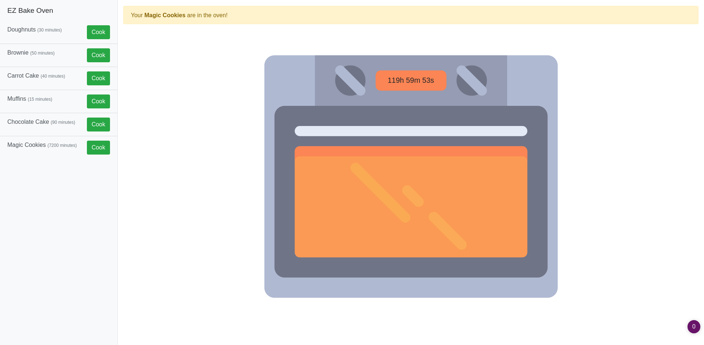
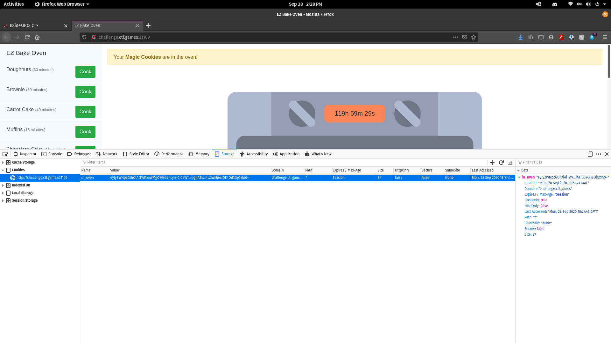
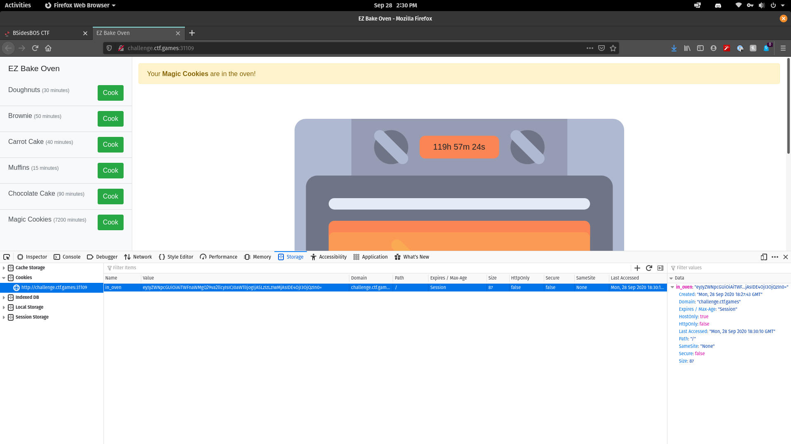
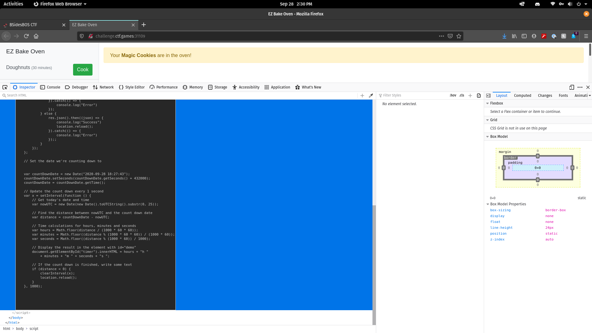
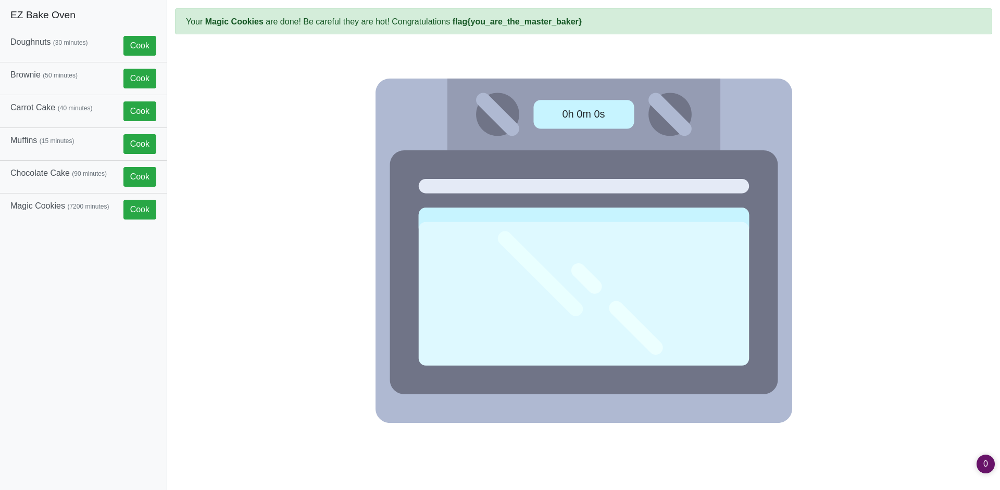

__EZ Bake Oven Writeup__
========================

By: _Jstith_

## Challenge:

```
Do you like baking? Don't leave the oven on for too long! 

http://challenge.ctf.games:31109/
```

**TLDR:** Decode, modify, and replace a cookie and reload the session via a javascript command written in the html code

## Solution:

### Initial Scouting

After clicking on the link, I was greeted by a page with an oven and different cookies I could bake. Some only took a few minutes, one took 5 days. I figured it was a safe bet you wouldn't get the flag from cooking the 30 minute one, so I went for the big guy.



### Digging Deeper

I looked at the HTML of the webpage, and found a javascript function but nothing I could directly use. I checked the cookies, and found one labeled `in_oven` with a base64 encoded string. I decoded the string, and found some data in JSON format.

```
eyJyZWNpcGUiOiAiTWFnaWMgQ29va2llcyIsICJ0aW1lIjogIjA5LzI4LzIwMjAsIDE4OjI3OjQzIn0=

{"recipe": "Magic Cookies", "time": "09/28/2020, 18:27:43"}
```



### Making the Change

Some quick math showed me that I needed to have started cooking my cookies 5 days ago for them to be finished now. I changed the string, and reencoded the data in base64.
```
{"recipe": "Magic Cookies", "time": "09/23/2020, 18:27:43"}

eyJyZWNpcGUiOiAiTWFnaWMgQ29va2llcyIsICJ0aW1lIjogIjA5LzIzLzIwMjAsIDE4OjI3OjQzIn0=
```



I proudly pasted the new cookie in... and... nothing happened. I was bummed, but not broken. I used inspect element on the timer to see where it was getting updated from, and found the javascript function in the HTML page I mentioned earlier. Turns out, the timer was just counting down, and wasn't checking the cookie at all. The script called a function called `location.reload()`. I hopped over to the console and called the function... victory!





```
flag{you_are_the_master_baker}
```