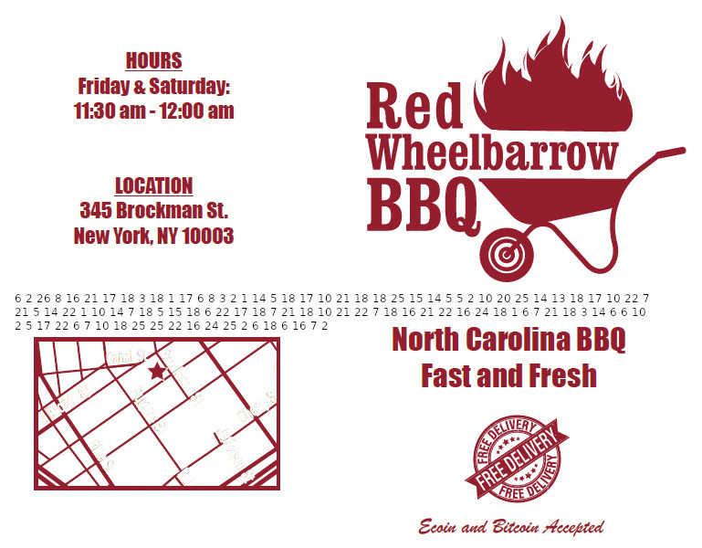

__Saving The World Writeup__
============================

By: _Jstith_

## Challenge

```
Sometimes I dream of saving the world. Saving everyone from the invisible hand, the one that brands us with an employee badge, the one the forces us to work for them, the one that controls us every day without us knowing it. But I can't stop it. I'm not that special. I'm just anonymous. I'm just alone.
```



**TLDR:** Convert numbers on pic to letters, rot cipher, steghide extract with provided password

## Solution

A little bit of osint showed me that the Red Wheelbarrow BBQ is a reference to a movie (or maybe TV show) where someone hid a message in the menu of a fictional BBQ joint called the Red Wheelbarrow. [The Red Wheelbarrow](https://www.poetryfoundation.org/poems/45502/the-red-wheelbarrow) is also a famous T. S. Elliot poem that seems to keep popping up in CTFs for some reason. Anyhow, the osint checks out, and there are a pattern on numbers on the menu. I noticed all of the numbers were between 1 and 16, which made me immediately think it was a simple number to letter cipher (A=1, B=2, etc). After copying down and converting the numbers to text, I got scattered letters.

```
6 2 26 8 16 21 17 18 3 18 1 17 6 8 3 2 1 14 5 18 17 10 21 18 18 25 15 14 5 5 2 10 20 25 14 13 18 17 10 22 7 21 5 14 22 1 10 14 7 18 5 15 18 6 22 17 18 7 21 18 10 21 22 7 18 16 21 22 16 24 18 1 6 7 21 18 3 14 6 6 10 2 5 17 22 6 7 10 18 25 25 22 16 24 25 2 6 18 6 16 7 2

Decoded to

F B Z H P U Q R C R A Q F H C B A N E R Q J U R R Y O N E E B J T Y N M R Q J V G U E N V A J N G R E O R F V Q R G U R J U V G R P U V P X R A F G U R C N F F J B E Q V F G J R Y Y V P X Y B F R F P G B
```

This wasn't quite right yet, but with all letters, I figured this might just be a rot away from plain text. I did a brute force rot and got the text we want.

```
SOMUCHDEPENDSUPONAREDWHEELBARROWGLAZEDWITHRAINWATERBESIDETHEWHITECHICKENSTHEPASSWORDISTWELLICKLOSESCTO
```

Throw some spaces in there... remember that poem I mentioned?

```
SO MUCH DEPENDS UPON A RED WHEEL BARROW GLAZED WITH RAIN WATER BESIDE THE WHITE CHICKENS THE PASSWORD IS TWELLICKLOSESCTO
```

What do we do with an image and a password? Steghide is a good place to start. In this case, it's all we need. Enter the password (lower case) and you'll get a flag.txt file with the flag for the challenge.

```bash
steghide extract -sf menu.jpg
```

```
flag{take_care_of_whiterose}
```
